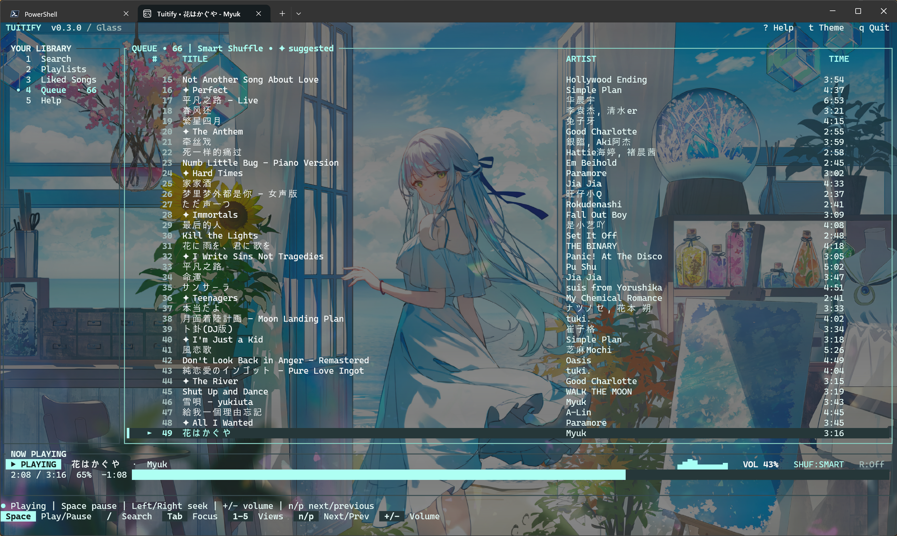
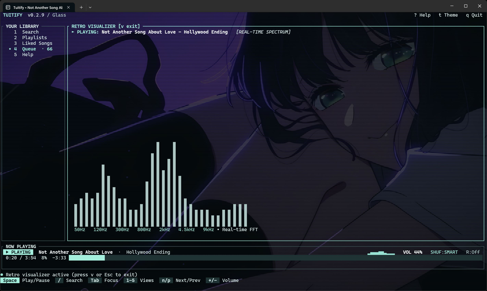
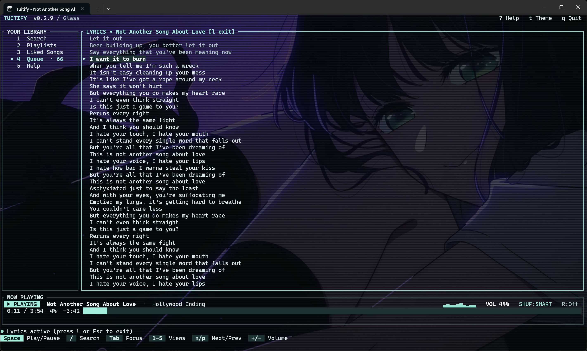

<div align="center">
  

  # Tuitify

  **A fast, keyboard-first music player for the Windows terminal.**

  Launch `tuitify` for Spotify Premium or free YouTube Music. Browse your library,
  manage the queue, view synchronized lyrics, and control playback from one native TUI.

  [](https://github.com/braces157/tutify/actions/workflows/ci.yml)
  [](https://github.com/braces157/tutify/releases/latest)
  [](#requirements)
  [](LICENSE)
</div>

---

Tuitify is a standalone music client built with Rust and Ratatui, using librespot
for Spotify and yt-dlp/FFmpeg for YouTube Music. It plays audio through the Windows
audio stack and keeps the whole listening
workflow inside Windows Terminal—no Electron shell and no background service.

> [!IMPORTANT]
> Spotify Premium is required for **Spotify** audio playback. YouTube Music
> mode plays public videos without a Spotify login or subscription. Plain
> `tuitify` selects YouTube Music for free accounts or users without a Spotify login.
> Tuitify is an independent,
> personal-use project and is not affiliated with or endorsed by Spotify.

## Preview

<p align="center">
  <a href="docs/assets/screenshots/v0.3.0/glass-queue-smart-shuffle.png">
    
  </a>
</p>

<p align="center"><strong>Glass queue with Smart Shuffle suggestions</strong></p>

<p align="center">
  <a href="docs/assets/screenshots/v0.3.0/glass-visualizer.jpg">
    
  </a>
</p>

<p align="center"><strong>Glass theme with the real-time FFT visualizer</strong></p>

<p align="center">
  <a href="docs/assets/screenshots/v0.3.0/glass-lyrics.jpg">
    
  </a>
</p>

<p align="center"><strong>Synchronized lyrics over a native-resolution wallpaper</strong></p>

> These captures document the v0.3.0 Glass interface; the visualizer and lyrics
> views were captured before its version label advanced from v0.2.9. The current
> v0.5.0 release keeps this appearance and adds the fixes listed below.

## Highlights

- **Direct playback** through librespot and WASAPI; Spotify Desktop can stay closed.
- **Automatic source selection** for Spotify Premium or free YouTube Music, with
  account connections inside F6 Tools and no source choice required.
- **YouTube Music** with search, video links, its own saved queue,
  playback controls, lyrics, visualizer, and Windows media keys.
- **Library and catalog browsing** for playlists, Liked Songs, complete album
  tracklists, and artist top tracks, plus track/album/artist search and link navigation.
- **Powerful queue tools** including play next, reorder, remove, undo, shuffle,
  repeat, Track Radio, and undoable cleanup of played entries, upcoming duplicates,
  and known unavailable tracks.
- **Sleep timers** for 15, 30, 45, or 60 minutes, or the end of the current track,
  with a visible countdown and paused playback when finished.
- **A responsive terminal UI** with keyboard and mouse support, six color themes,
  a semantic color system, restrained selection/focus states, a real-time FFT
  audio visualizer, and a wallpaper-backed Glass theme. On Windows Terminal,
  Glass uses a dedicated native profile so the wallpaper stays at full display
  resolution; other terminals fall back to the Unicode cell renderer.
- **Synchronized lyrics** from LRCLIB with automatic scrolling.
- **Windows integration** for media keys, system media controls, metadata, and the
  playback timeline.
- **Discord Rich Presence** with track artwork and playback state; easy to disable.
- **Local listening statistics** with aggregate play counts and listening time—no
  analytics service or timestamped listening history.
- **Resilient sessions** with a persisted queue, atomic state writes, metadata
  caching, credential refresh, and paused-on-start restoration.

### Current release

The current release is **v0.5.0**. Just launch `tuitify`: confirmed Spotify Premium
accounts use Spotify; free accounts and users without a Spotify login use YouTube
Music. F6 Tools connects accounts and updates playback tools inside the app.
The update adds public music search, albums, artists, radio, optional Google
libraries, and independent provider queues. Bounded parsed caches and idle helper
shutdown reduce retained memory. Existing queue tools, recovery, diagnostics,
lyrics, Glass themes and Windows media controls remain available.

The wallpaper-backed Glass theme supports both a portable Unicode renderer and a
full-resolution Windows Terminal profile. See the [release notes](docs/releases/v0.5.0.md)
and [changelog](CHANGELOG.md) for the complete update.

## Requirements

- Windows 10 or 11 on x86-64
- [Windows Terminal](https://github.com/microsoft/terminal) or another terminal with
  modern color and mouse support
- For Spotify playback: a Premium account, network connection, and working
  Windows audio output device
- For YouTube playback: public videos, a network connection, Windows audio,
  yt-dlp, Deno, and FFmpeg (prepared on first launch; F6 updates the tools)
- For YouTube Music search, albums, artists and radio: Python 3.10+;
  the isolated music adapter installs on the first player launch

No Rust installation is needed when using a release build. Consolas and Cascadia
Mono work out of the box; an icon font is not required.
Use 80 columns × 24 rows or larger; the minimum supported layout is 32 × 10.
At 32 × 10, Mix Builder shows the selected preview track, pin state, compact
apply/cancel controls, and a scrollable details shortcut; use a larger window to
inspect multiple preview rows comfortably.
The native demo needs no Spotify account or audio device.

## Install

1. Download `Tuitify-0.5.0-windows-x86_64.zip` from
   [release v0.5.0](https://github.com/braces157/tutify/releases/tag/v0.5.0).
2. Extract the archive.
3. Open Windows Terminal in the extracted folder and run:

```powershell
.\tuitify.exe
```

Just run **`tuitify`**. A connected Spotify Premium account plays Spotify; free
accounts and users without a Spotify login get YouTube Music automatically.
Missing playback tools and the isolated music adapter are prepared on first
launch (Python 3.10+ for the music adapter). Public search needs no account.
Press **F6** and choose **Connect Spotify account** or **Connect Google music
library** for browser sign-in. The app saves your queue, connects the account,
and returns to music automatically. No source flags or separate login commands
are needed. Windows Credential Manager and user-encrypted Google storage keep
subsequent launches connected.
Plan checks are bounded to three seconds and successful results are cached for
ten minutes for the same account. If Spotify's API omits subscription details,
an existing streaming login can verify its entitlement without opening audio.
An expired login, denied access or failed check shows its cause and opens free
music. Only a confirmed Spotify membership change updates the cached plan.
Restored queues always start paused; press Space to resume.

To install the executable for your Windows user and add it to `PATH`, run:

```powershell
.\scripts\install.ps1
```

The installer copies `tuitify.exe` to `%LOCALAPPDATA%\Programs\Tuitify`, updates
the user `PATH` idempotently, and verifies the installed executable. Open a new
terminal afterward and run `tuitify` from any directory.

The release archive includes the same installer under `scripts`. You can also
keep the archive in a permanent folder and add that folder to your user `PATH`
manually.

### Play YouTube without Spotify

Free music is included in the normal launch:

```powershell
tuitify
```

Browsing, radio and playback all use the selected provider, with separate queues
and saved libraries. Spotify playlists are not automatically mapped to YouTube.
`tuitify --glass` uses your existing Glass appearance; use
`tuitify --glass-window` for a dedicated Windows Terminal tab. Source selection
stays automatic in both.

Press `/` to enter a song/artist search or paste a YouTube video link. `Enter`
plays the selected result and the loaded result list; `e` adds a result to the
queue, and `Ctrl+Enter` plays it next. Space pauses/resumes, Left/Right seek,
`+`/`-` adjust volume, and `n`/`p` move through the queue. Repeat, shuffle,
queue editing/filtering, sleep timers, media keys, the visualizer, and lyric
lookup work in YouTube mode.

To connect your Google library, press F6 and choose **Connect Google music library**.

Sign in in the dedicated **Chrome** window and click **Library**. Chrome is
preferred when installed; Edge is the fallback. This automatically installs the
optional YouTube Music adapter in an isolated environment and requires Python
3.10 or newer. You can install it separately with `tuitify youtube music-setup`.
The adapter uses the unofficial, read-only ytmusicapi interface, so changes to
YouTube Music can require an adapter update.

Back in the player, `2` opens your playlists, `3` opens Liked Songs,
and `F3` searches your saved library. Paste a YouTube playlist URL into search
to open it directly. Album and artist views use YouTube Music song metadata.
Playing a list loads its remaining pages into the queue. `s` cycles your
existing Shuffle and Smart Shuffle algorithms; Smart Shuffle adds YouTube Music
radio suggestions and preserves the current track. Installing the adapter also
enables public music search, album/artist views and radio without signing in.
Without the adapter, Track Radio uses YouTube search suggestions.

Music search returns its first 20 results promptly; scrolling loads further
pages. The music helper reuses its connection, and recently loaded library
pages open from memory. The player prepares the next queued stream while the
current song plays, so normal skips avoid resolving the stream again. The first
song and unprepared selections still need YouTube's network response. Stream
links expire, remain in memory only, and are refreshed when needed.

Read-only command-line previews return the first page (up to 50 entries):

```powershell
tuitify youtube playlists
tuitify youtube liked
tuitify youtube playlist "https://music.youtube.com/playlist?list=PLAYLIST_ID"
tuitify youtube logout
```

The YouTube queue, settings, cache, statistics, and recipes live under
`%LOCALAPPDATA%\Tuitify\youtube`; Spotify's existing data stays separate. The
queue restores paused. The connection reads only YouTube Music session cookies
from the new sign-in window and stores them in `music-auth.dpapi`, encrypted for
your Windows user. Your password stays in the browser; existing browser profiles
are not read. `youtube logout` removes the connection; restart the player to apply.
Signing in grants library access; playback still uses public videos. Live,
private, age/sign-in restricted, and paid videos are not supported. Tuitify does
not store audio downloads. Lyric matches depend on the available song metadata.

Check tools or validate real audio without changing saved state:

```powershell
tuitify youtube doctor
tuitify youtube search "artist song"
tuitify youtube probe "https://youtu.be/VIDEO_ID" --seconds 5
```

The probe is muted by default; add `--volume 30` to hear it. The setup command
downloads SHA-256-verified official yt-dlp/Deno releases into
`%LOCALAPPDATA%\Programs\Tuitify\tools` and installs verified FFmpeg if it is
missing. Run setup again to update the tools when YouTube changes. Public videos
can still be blocked by YouTube or unavailable on your connection.

### Try the native demo without Spotify

Run the actual terminal application in its isolated demo mode:

```powershell
.\tuitify.exe demo
```

For an executable on `PATH`, use `tuitify demo`. The offline demo runtime bundles
representative fictional album and artist catalog datasets, allowing you to test
native album tracklists, artist top tracks discovery, breadcrumb navigation, and
context menus without network access, credentials, Discord, or audio devices. Demo
data is session-only and does not read or write the production queue, settings,
statistics, recipes, or credentials.

## Sign in

Tuitify uses two PKCE authorizations: one for Spotify catalog access and one for
librespot streaming. Both are browser-based, require the same Spotify account, and
never expose your password to Tuitify.

The default setup uses Spotatui's shared catalog client, so you do not need a client
secret or your own Spotify Developer application:

```powershell
.\tuitify.exe auth
```

The second authorization may be labelled **Spotify for Desktop** by Spotify. This
is the librespot streaming identity; it does not launch or require Spotify Desktop.

### Use your own Spotify application

If you prefer a personal Web API application:

1. Create an app in the [Spotify Developer Dashboard](https://developer.spotify.com/dashboard).
2. Enable Web API access and register `http://127.0.0.1:8989/callback` as a redirect URI.
3. Run the setup with the app's public client ID:

```powershell
.\tuitify.exe auth --client-id YOUR_SPOTIFY_CLIENT_ID
```

Do not supply a client secret. Spotify development-mode restrictions still apply;
the account may need to be explicitly allow-listed in your Developer Dashboard.

To replace a revoked login, use `auth --force`. To replace only the streaming
authorization, use `auth --streaming --force` and select the same account.
Close the player before running authentication or maintenance commands. Signing
back into the same verified catalog account preserves queue, cache, and statistics.
Tuitify stores Spotify's stable Web API account ID separately from the legacy
user ID and the authenticated streaming username. Older credentials remain
readable; reauthentication verifies and upgrades their identity metadata. A
changed legacy user ID does not imply a changed account when the stable account
ID still matches. See [Spotify's account ID update](https://developer.spotify.com/documentation/web-api/references/changes/may-2026).

Different or unverifiable accounts stop authentication and preserve local files.
To deliberately switch accounts or recover an unidentifiable previous login,
first create a backup with `tuitify backup FILE`, then use `tuitify logout` and
authenticate again. Logout deliberately removes credentials, queue, cache, and
statistics; recipes and settings remain. Streaming verification starts no audio.
A current legacy user ID matching the authenticated streaming username, or a
previous mapping with a freshly verified stable account ID, avoids an extra
streaming-client profile request. Otherwise, Tuitify checks the profile belonging
to the streaming token against the catalog profile. If Spotify denies or throttles
that check, setup reports the actual failure and preserves saved state. Existing
matching credentials still open without a network identity check; a verified
mapping is established on reauthentication.

Both callbacks
listen only on `127.0.0.1:8989`; the shared client uses `/login`, while a personal
catalog app uses `/callback`.

## Controls

Press `?` or `F1` outside text entry for help. Mix Builder uses these keys for its
own details. While typing a search or recipe name, ordinary shortcut letters enter
text; finish text entry before using playback commands.

| Key | Action |
| --- | --- |
| `1`–`5` | Open Search, Playlists, Liked Songs, Queue, or Help |
| `Tab` / `Shift+Tab` | Move focus between navigation and content |
| `↑` / `↓` or `k` / `j` | Move the selection |
| `Enter` | Search, open, or play the selected item |
| `Space` | Pause, resume, or retry playback |
| `n` | Next track |
| `p` | Play next (in Album/Artist views) / previous track |
| `←` / `→` | Seek backward / forward 10 seconds |
| `+` / `-` | Change volume by 5% |
| `m` | Mute or restore volume |
| `s` | Cycle shuffle off → shuffle → Smart Shuffle |
| `r` | Cycle repeat off → queue → track |
| `a` | View album tracklist for selected track |
| `A` (`Shift+A`) | View artist tracks for selected track |
| `e` | Add selected track to queue |
| `Ctrl+Enter` | Play selected track next; in Queue, move its existing occurrence |
| `F6` | Open sleep timers and queue cleanup |
| `Ctrl+R` | Restore the last cleared Queue filter |
| `Esc` | Back to previous view / exit overlay / quit |
| `K` / `J` | Move the selected queue item up / down |
| `u` or `Ctrl+Z` | Undo the last queue edit |
| `R` | Start Track Radio from the selected track |
| `M` (`Shift+M`) | Open Mix Builder from Queue or an active/selected playlist |
| `l` / `v` / `S` | Toggle lyrics / visualizer / statistics |
| `t` | Cycle color themes |
| `/` or `f` | Filter Queue or loaded Liked Songs/playlist rows; `/` opens search from other views |
| `F2` / `F3` | Search Spotify / search your saved library |
| `F4` | Inspect skipped sources in saved-library search |
| `F5` | Refresh catalog data, retry metadata, or retry lyrics in the lyrics view |
| `Home` / `End` | Seek to the start / end of the track |
| `[` / `]` | Adjust volume by 1% outside Mix Builder |
| `C` / `Delete` | Clear the queue / remove its selected entry |
| `q` or `Ctrl+C` | Save and quit |

### Find a song in your queue

Open Queue with `4`, then press `/` or `f` and type words from a song title,
artist, or album. Matching ignores letter case and accepts words across those
fields. The counter shows matches out of the full queue, and row numbers keep
their original queue positions. Filtering uses loaded metadata; tracks without
information are counted, and new matches appear as metadata arrives.

Press `Enter` to finish typing, then use the usual playback, reorder, remove,
Radio, and album/artist actions on the selected match. Reordering moves one
position in the full queue; duplicate songs remain separate entries. `Esc` or
the clickable **Esc Clear** control restores all rows without quitting, and `.`
clears the filter and jumps to the current track. Whole-queue clearing requires
clearing the filter first. Undo remains available for queue edits.

Press `Ctrl+R` outside text entry to restore the last cleared queue filter.

### Sleep timers and queue cleanup

Press `F6`, or click the Now Playing title, to open **Listening Tools**. Choose
with the arrow keys or mouse, then press Enter or click **Enter Apply**. Esc
closes the menu without applying the selected option.

- **Sleep timers:** Pick 15, 30, 45, or 60 minutes, or **Stop after current track**.
  The countdown appears in Now Playing and the tools menu. Timed sleep uses wall
  time and continues while playback is paused. On expiry, playback pauses and
  retains the queue and position; Space resumes. End-of-track mode requires a
  loaded track and overrides Repeat; switching or restarting a track cancels
  that mode. Timers are session-only. **Cancel sleep timer** leaves playback and
  volume unchanged.
- **Queue cleanup:** Remove entries before the current track, duplicate upcoming
  track IDs, or tracks whose loaded metadata says they are unavailable. Cleanup
  applies to the full queue, preserving the current occurrence, playback position,
  and shuffle order. Unknown availability is kept. Upcoming deduplication keeps
  the earliest upcoming occurrence and excludes another copy of the current
  track; played history stays. Press `u` or `Ctrl+Z` afterward to undo, paused.
- **Play Next:** Press `Ctrl+Enter` on a track outside text entry. Catalog views
  add it next; Queue moves the selected occurrence next without adding a copy.

While typing a search, Up recalls earlier submitted queries and Down moves toward
the newest query, then restores your unsent draft. The last 20 unique queries stay
in memory for this session; recalling them does not submit a network search.

### Wallpaper / Glass background

On Windows Terminal, Tuitify creates a small `Tuitify Glass` profile fragment and lets
Windows Terminal draw the image at native GPU resolution. The wallpaper runs across the
full interface while selected rows and key hints retain opaque contrast surfaces. The image
settings are also saved on the Tuitify Glass profile in `settings.json` to ensure Terminal
loads the styled image. Other profiles are preserved, and the original settings are backed
up as `settings.json.tuitify-backup`.

Use your current Windows wallpaper:

```powershell
tuitify background
```

Or choose a JPEG, PNG, WebP, or BMP and adjust readability with `--dim` (`0` to `85`):

```powershell
tuitify background "C:\path\to\wallpaper.jpg" --dim 52
```

A single image is used in both terminal orientations. For separate landscape and
portrait artwork, pass both paths:

```powershell
tuitify background --horizontal "C:\path\to\wide.jpg" --vertical "C:\path\to\tall.jpg" --dim 48
```

You can set either orientation independently. `tuitify background --dim 52`
changes dimming while keeping the configured images; running `tuitify background`
with no options restores the Windows wallpaper and default dimming. In Glass,
the interface text fades after 20 seconds without keyboard, mouse, or media-key
input and returns when input resumes. The playback panel stays bright.

Running `tuitify` stays in the current terminal using the Unicode image renderer.
Run `tuitify --glass` to start directly in the current terminal with the Glass background
theme enabled. Run `tuitify --glass-window` to open a dedicated native GPU Glass tab in
the current Windows Terminal window with a clean, full-resolution smoothly dimmed background image.
If Windows Terminal is unavailable, the current-terminal renderer is used. Press `t` in Tuitify to cycle away from or back to
Glass. Selected rows and status badges stay opaque so controls remain legible over detailed
artwork.

Windows media keys can control Play/Pause, Next, and Previous while Tuitify is
unfocused. Terminals that support mouse reporting can also select, scroll, seek,
toggle playback, and open context menus (including "View Album" and "View Artist"
actions on track rows).

Press `S` (`Shift+S`) for Song Statistics. Click rows to select them, use the
mouse wheel to scroll, and click the footer to search, change sorting, finish
editing, or clear the filter. Click the exit label in the title to close the view.
Long searches keep the footer actions visible, including in a 32 × 10 terminal.

## Album and artist browsing

Tuitify includes native in-terminal browsing for albums and artists:

- **Album tracklists:** Select any track in Search, Liked Songs, or Queue and
  press `a`, or right-click to choose **View Album**. This opens the full album
  tracklist showing ordered track numbers, song titles, artist credits, durations,
  and playability indicators. Press `Enter` to play, `e` to enqueue, or `p` to
  play next.
- **Artist tracks:** Select any track and press `Shift+A` (or `A`), or
  right-click to choose **View Artist**. Results from Spotify's Top Tracks endpoint
  are labeled **Top Tracks**. When access is restricted, verified artist-ID search
  matches are labeled **Artist Search**; row numbers follow search order. PgDn
  continues that search, including pages with no verified matches; F5 rechecks
  Top Tracks access. Both sources show album names, durations, and playback/queue
  actions. The native offline demo labels fictional results **Demo Tracks**.
- **Breadcrumb navigation & history stack:** Navigating into albums and artists
  pushes your viewing context onto an in-memory navigation stack and displays a
  dynamic breadcrumb trail in the catalog header (e.g. `Search › OK Computer › Thom Yorke`).
  On narrow terminals, breadcrumb segments collapse gracefully (`… › Thom Yorke`).
  Press `Esc` at any time to pop the stack and return to the previous view, exactly
  restoring your prior selection cursor and scroll position without redundant network requests.
- **Instant search link & URI resolution:** Paste or type Spotify Album and Artist
  web URLs (such as `https://open.spotify.com/album/<id>`, internationalized
  `/intl-<locale>/` links, or URLs with query parameters) or Spotify URIs
  (`spotify:album:<id>`, `spotify:artist:<id>`) directly into the Search input box (`F2`
  or `1`). Pressing `Enter` resolves the entity instantly and opens the corresponding
  album or artist view without running a text search.

## Using Mix Builder

Open Queue with `4`, or open an accessible playlist with `2`, then press `M`
(`Shift+M`). The preview is separate from the live queue and playback until you
explicitly apply it.

- Press `3`, `4`, or `6` for a 30-, 45-, or 60-minute target.
- Press `[` or `]` to lower or raise the desired suggestion percentage, and `a`
  to cycle artist spacing.
- Move with `↑`/`↓`, press `?` for the full selected-track provenance and any
  limitations, and press `p` to pin a preview position.
- Press `g` to regenerate unpinned positions. In demo mode, the first suggestion
  request intentionally fails; `g` retries and demonstrates source-only recovery.
- Press `Enter` to replace the queue or `A` to append. Both are explicit and
  undoable with `u` or `Ctrl+Z`; `Esc` cancels without changing playback or queue.
- Press `w` to name and save a local recipe. Press `o` to cycle through and reopen
  saved recipes.

Mix Builder also supports clicking preview rows and the displayed pin, target,
suggestion, artist-spacing, regenerate, save/reopen, details, and cancel controls.
The mouse wheel selects rows or scrolls details. Wrapped controls remain clickable
in narrow terminals, and recipe save/cancel buttons stay visible with long names.
Applying a preview uses `Enter` to replace or `A` to append.

Duration, suggestion ratio, and artist spacing are preferences. Suggestion
percentages are measured by **track duration**, not song count. The builder shows
the achieved duration and ratio; `?` opens full details, and Up/Down scroll them.
Esc first closes details or text entry, then cancels the builder.

Source collection retains at most 25,000 track occurrences, with up to 500 pages
for playlists; incomplete or capped sources are labeled partial. Previews contain
at most 500 tracks. Recipes save a source and settings, not a fixed queue or pins;
reopening can fetch new data. Up to 100 recipes are stored, with an existing name
updated when you save it again. Replacement pauses playback; appending preserves it.

## Search scopes and queue behavior

- **Filter loaded rows:** `/` or `f` in Liked Songs or playlists searches only
  data already fetched into that view.
- **Spotify search:** F2 searches tracks across Spotify's catalog. Enter plays
  the selected result and starts Track Radio in the background.
- **Saved-library search:** F3 scans saved Liked Songs and accessible saved
  playlist tracks across pages. It needs network access and can take time.
  Inaccessible playlists are skipped while later playlists continue; their names
  and reasons are available with F4. A finished scan with skipped sources shows
  partial coverage. Authentication failures, service waits, outages, and invalid
  responses stop the scan and retain matches. Esc cancels while retaining partial
  matches and skipped sources; F5 starts a fresh scan and rechecks access.

Playing from Liked Songs or a playlist replaces the queue with the loaded rows
(or filtered loaded rows). Load more pages before playing to include them, or
select a playlist and press `a` to append its pages asynchronously. Playing an
entry already in Queue keeps that queue. Playlist enqueues and saved-library scans
retain partial results after a later-page failure and offer explicit retries.

## How playback and recommendations work

Track Radio and Smart Shuffle use Deezer's related-artist metadata to discover
other artists, then find and verify their tracks in Spotify. Radio adds up to
15 tracks per batch, with at most three per primary artist. Searches stay
anchored to the original artist across refills. The queue identifies the source
as "Similar artists • Deezer". This is artist similarity, not Spotify's private
personalization or a guarantee of matching a song's mood and energy.

Latin accent differences between catalogs, such as "Minh Vương M4U" and
"Minh Vuong M4u", are accepted only after confirming a matching seed recording.
Exact names remain preferred, and ambiguous artist identities are rejected.
Queue sizes vary with available matches: up to fifteen suggestions plus the
selected song, rather than a guaranteed sixteen-song queue.

Smart Shuffle mixes marked suggestions after every three original tracks while
preserving playback. Related-artist and Spotify candidate results are cached to
avoid repeating requests on mode changes. If similarity is unavailable, the app
reports an error and preserves the queue instead of filling it with one artist.

See [`docs/smart-shuffle-validation.md`](docs/smart-shuffle-validation.md) for the
discovery rules, live acceptance seeds, privacy boundaries, and retry behavior.

Spotify limits some Web API endpoints for newer or development-mode applications.
Tuitify reports restricted playlist and recommendation responses instead of trying
to bypass them. See Spotify's
[Web API changes](https://developer.spotify.com/blog/2024-11-27-changes-to-the-web-api)
and [February 2026 migration guide](https://developer.spotify.com/documentation/web-api/tutorials/february-2026-migration-guide).

## Data and privacy

OAuth tokens are stored in **Windows Credential Manager**, not in project files.
Application state lives under `%LOCALAPPDATA%\Tuitify`:

| File | Contents |
| --- | --- |
| `config.json` | Public client ID and player preferences |
| `queue.json` | Queue order, selection, and saved position |
| `cache.json` | Bounded, expiring Spotify track metadata |
| `stats.json` | Aggregate play counts and listening time |
| `mix-recipes.json` | Named Mix Builder source and preference recipes |

Tuitify does not collect analytics, store your Spotify password, keep a timestamped
listening history, or provide an offline audio cache. Discord presence is enabled
by default: song details, artwork, and timing go to the local Discord client, which
may show them to other people according to your Discord privacy settings. To
disable it, close Tuitify, set `"discord_rpc": false` in `config.json`, and restart.

Opening lyrics sends the track title, artists, and duration to LRCLIB; Spotify
tokens are not sent there. A missing full-credit match can retry the primary
artist, validating the returned title, artist, and duration. Unicode accents are
preserved. HTTP 502–504 errors can retry once with a short wait; longer server
cooldowns and HTTP 429 remain explicit errors. Artwork may use Spotify's public oEmbed service when
catalog artwork is missing. These requests are separate from analytics.
Radio and Smart Shuffle send the seed artist's name to Deezer's public metadata
API; resolving ambiguous artist names can also send the seed song title. Spotify
tokens, account identifiers, playlists and listening statistics are not sent to
Deezer. Similarity results are cached in memory, not written as a listening profile.
Settings and queue changes are checkpointed asynchronously and restored paused.

Close the player before backing up or restoring so the saved files form a
consistent snapshot. Create a new backup file outside the live data directory:

```powershell
tuitify backup "saved-state.json"
tuitify restore "saved-state.json"
```

The second command validates the backup and previews each file's create,
replace, remove, or unchanged action. It prints a complete command with
`--confirm` and a token to apply that exact preview. If the backup, destination,
or current files change, generate a new preview before applying it. Backups
preserve duplicate queue occurrences, queue order/position, settings, Mix recipes,
and existing aggregate statistics. Missing snapshots explicitly restore the
default state by removing that saved file; they do not merge with current state.
Existing backup files are never overwritten.

Credentials, replaceable cache, runtime state, and image files are excluded;
background image paths remain settings. Backup and restore do not log in, start
music, or contact Spotify. Inputs and combined saved state are bounded to 64 MiB.
An interrupted restore is rolled back before the next locked command loads state.
Malformed recovery journals or unexpected external edits stop recovery and retain
the journal and files for inspection. Completed restores only clean up their journal.

Useful maintenance commands:

To recover just one state file, use `state`. Select `config`, `queue`, `recipes`,
`stats`, or `cache` (the corresponding JSON filenames are accepted too):

```powershell
tuitify state inspect
tuitify state inspect recipes
tuitify state backup recipes "recipes-original.json"
tuitify state reset recipes
tuitify state restore recipes "saved-state.json"
```

Inspection reports the filename, unsupported version, or failed invariant without
printing song history or raw JSON. Missing files use defaults. It returns a failing
exit code when a selected file is invalid. Component backups retain exact bytes
even when a file is damaged or from a newer Tuitify version. They never overwrite
an existing backup and must stay outside the live data directory. Unlike a
whole-state backup, a component backup can include replaceable cache.

Reset and targeted restore default to a preview and print the complete command
with `--confirm TOKEN`. Before applying, they preserve the original selected file
in a component backup beside the live data directory; use `--backup FILE` to choose
another external destination. Confirmation binds the file's current bytes,
destination, operation, restore source, and original-file backup path. Other state
files and Windows credentials are left unchanged. If the recovery write fails,
the shared restore journal recovers the exact original. An existing different
backup at the archive path stops recovery instead of being overwritten.

Targeted restore accepts either a component backup for that same file or the
selected snapshot from a whole-state backup. Restore validates the incoming
version and invariants; a damaged or future-version component can be backed up
but cannot be loaded by this build. Supported component snapshots retain their
exact bytes, including unknown fields. Normal reads/writers and whole-state
restore preserve unsupported future versions; a deliberately confirmed targeted
reset/restore keeps their original bytes in the external component backup.
State inputs are bounded to 64 MiB and encoded component backups to 90 MiB.

For disposable cache or deliberate logout:

```powershell
# Remove cached metadata while keeping login and queue data
.\tuitify.exe clear-cache

# Remove credentials, queue, metadata cache, and listening statistics
.\tuitify.exe logout
```

Logout retains device settings, the public client ID, and `mix-recipes.json`,
including saved playlist names and IDs.
Use `tuitify state reset recipes` with the player closed to preview clearing only
recipes while keeping an original-file backup.

## Troubleshooting

Start with read-only diagnostics:

```powershell
tuitify doctor
tuitify doctor --json
# Explicitly opt into bounded Spotify GET checks (10 seconds per probe)
tuitify doctor --network
# Optional resource-specific checks use 22-character Spotify IDs
tuitify doctor --network --artist ARTIST_ID --playlist PLAYLIST_ID --seed-track TRACK_ID
```

Doctor checks the exact on-disk executable hash, current and saved Windows PATH,
terminal size, data directory, all five state files, credential presence/expiry
and local account mapping, and Windows output-device configuration. It works
without starting music, opening a login browser, creating the data directory,
acquiring the instance lock, or recovering/removing a restore journal. Run it with
the player closed for a stable file snapshot. Failures include recovery actions
and produce a nonzero exit code; warnings and unknown checks need further review.

Offline is the default. `--network` uses only an existing unexpired catalog token
for profile, liked-song and playlist-list GETs. Optional artist/playlist/seed
checks observe only that account and resource, without discovery fallback or
library writes. Doctor never refreshes tokens, including after HTTP 401; normal
player startup can refresh expired saved logins. Systemic failures stop later
probes, and rate limits/quota exhaustion retain their distinct recovery guidance.
Use `--timeout 1` through `--timeout 30` to adjust each network probe's deadline.

Device enumeration does not prove audible playback, and untested catalog
capabilities remain unknown. `--json` is local diagnostic output and includes
installation/data paths; inspect it before sharing. It omits token values,
account IDs, song titles, and upstream payloads.

Press **F7** in the player to inspect the last 64 classified session errors.
Volume changes and later successful status messages keep these records intact.
Use arrows, Page Up/Down, Home/End or the mouse wheel to navigate; Esc/F7 closes
the panel. Text-entry modes keep their existing shortcuts. The journal belongs to
this player session and is not saved with the queue or listening statistics.

In F7, press **r** to inspect a redacted support-report snapshot. Scroll through
the JSON before pressing **e** to save exactly that snapshot to a new
`tuitify-support-*.json` file in the launch directory. Later errors still enter the
session journal; they do not silently change the report you reviewed. Press r
twice to return to errors and capture a fresh snapshot. Existing files are never
overwritten, and exports are kept outside the live data directory.

For startup troubleshooting, preview or explicitly save a separate local report:

```powershell
tuitify support
tuitify support --output "support-report.json"
```

Support reports include compiled source/build identity, OS/architecture, the on-disk executable
hash at preview creation, classified failing subsystems, HTTP/retry information
when available, and aggregate catalog capability observations. A standalone
`support` command runs offline read-only doctor checks and exports their allowlisted
result codes; it cannot read another player's session error journal. Zero capability
observations mean unknown. Reports omit tokens, callback URLs, raw errors/payloads,
account/resource IDs, personal paths, device names, search queries, queue contents
and song history. Nothing is uploaded automatically; inspect the file before
sharing it. This differs from `doctor --json`, which includes local paths.

Inspect the exact compiled build without loading saved state or authentication:

```powershell
tuitify version
tuitify version --json
```

`--version` still prints the short package version. Detailed output embeds the
commit when available, whether compiled source was dirty, a source SHA-256,
target, profile, compiler, settings digest and build ID. Source archives without
Git metadata report an unavailable commit and unknown dirty status while still
embedding their source digest. The source digest covers the exact file bytes and
relative names in `src`, `Cargo.toml`, `Cargo.lock`, `build.rs` and
`build_support.rs`. It excludes documentation, local listening state and paths.
Build IDs distinguish source/compiler/settings variants of the same version;
they are provenance identifiers, not signatures or a promise of reproducible
linker bytes. The separately named on-disk executable hash describes the file
currently at the launch path; replacing it does not change a running process.

`scripts/release.ps1` runs the checks and release build before packaging. It
rejects stale executables by comparing the embedded source digest with the
current source, stages into a new directory, checks local documentation/resource
links, extracts the ZIP and verifies every payload file's size and SHA-256.
The ZIP's `release-manifest.json` lists the payload, while the external
`Tuitify-VERSION-windows-x86_64.manifest.json` hashes the executable, ZIP, and
internal manifest. This avoids a circular manifest self-hash. Failed validation
does not publish a new package. The packaging-only helper records that it did
not run build/test checks and is intended for package regression checks.

- **Expired/revoked login:** exit and run `tuitify auth --force`, or
  `tuitify auth --streaming --force` for a streaming-only problem.
- **No audio:** check Premium, volume, and the default Windows output; Space
  retries failed playback. A restored queue is paused until you resume it.
- **Network or catalog error:** F5 retries catalog/metadata requests. For HTTP
  429, wait for the reported cooldown instead of repeating authentication.
- **Restricted playlist:** Spotify may allow listing a playlist but restrict its
  contents to owners or collaborators in development mode.
  Tuitify remembers item-specific access restrictions for up to five minutes;
  F5 rechecks access immediately while keeping service cooldown/quota waits.
  These session observations reset when the catalog client/account changes.
- **Radio unavailable:** press `R` to start a fresh Radio session. Available
  suggestions depend on the provider's artist coverage; a restored queue does
  not rerun discovery after an update.
- **Lyrics unavailable:** press `F5` in the lyrics view. A 503 is a temporary
  LRCLIB server failure; percent-encoded Vietnamese/Japanese characters in a URL
  are normal. A missing result can mean the provider has no lyrics for that recording.
- **Invalid config, queue, statistics, or recipes:** Tuitify reports the path and preserves the file.
  Close the player and move it aside before restarting to reset that state.

## Build from source

Install stable Rust for `x86_64-pc-windows-msvc`, Visual Studio 2022 Build Tools
with **Desktop development with C++**, and the Windows SDK. The minimum supported
Rust version is **1.88.0** for Windows x64, including the locked test dependencies.
The application and `wiremock` use let chains, which require Rust 1.88; Rust 1.85
fails to compile the locked test graph. CI reads `rust-version` from `Cargo.toml`
and tests all targets and builds the release at that minimum on
`x86_64-pc-windows-msvc`. Formatting and strict Clippy run separately on stable.

```powershell
git clone https://github.com/braces157/tutify.git
cd tutify
cargo build --release --locked
```

The executable is written to `target\release\tuitify.exe`.

To reproduce the minimum-toolchain checks without changing your default compiler:

```powershell
rustup toolchain install 1.88.0 --profile minimal --no-self-update
cargo +1.88.0 test --locked --all-targets --target x86_64-pc-windows-msvc --target-dir target/msrv
cargo +1.88.0 build --release --locked --target x86_64-pc-windows-msvc --target-dir target/msrv
```

Minimum-toolchain artifacts stay under `target/msrv`, separate from the usual
release executable used by the installer. ARM64 support remains subject to the
dedicated build and hardware validation in the future plan.

Before contributing, run the same checks used by CI:

```powershell
cargo fmt --check
cargo test --locked
cargo clippy --all-targets --locked -- -D warnings
cargo build --release --locked
```

The static project website uses Node.js 22 or later:

```powershell
npm ci
npm run build
npm test
```

## Project docs

- [Architecture](ARCHITECTURE.md) — module boundaries, state ownership, and runtime design
- [Benchmarks](BENCHMARKS.md) — reproducible terminal rendering measurements
- [Validation](VALIDATION.md) — completed checks and remaining acceptance limits
- [Changelog](CHANGELOG.md) — changes in each release
- [Roadmap](ROADMAP.md) — planned work and explicit non-goals
- [Performance review](PERFORMANCE_REVIEW.md) — profiling findings and optimization notes
- [Refactor review](REFACTOR_REVIEW.md) — structural review and safeguards

## Scope

Tuitify is personal-use software built on unofficial librespot integration, so
Spotify service changes can break playback. It intentionally does not support
podcasts, offline downloads, playlist editing, background playback services, or
cloud listening analytics.

Released under the [MIT License](LICENSE).
